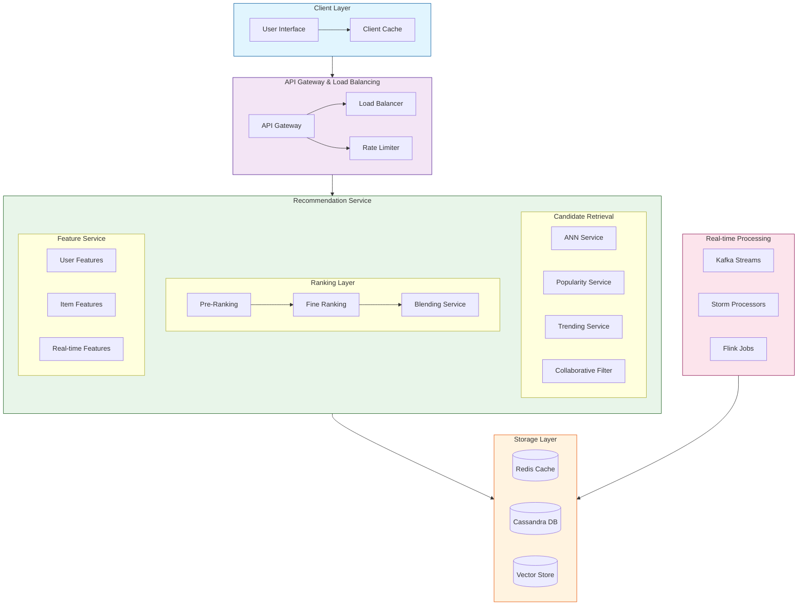
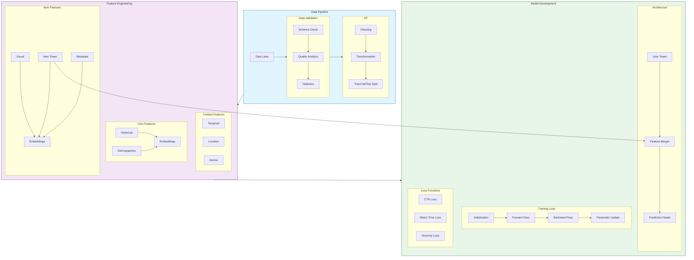
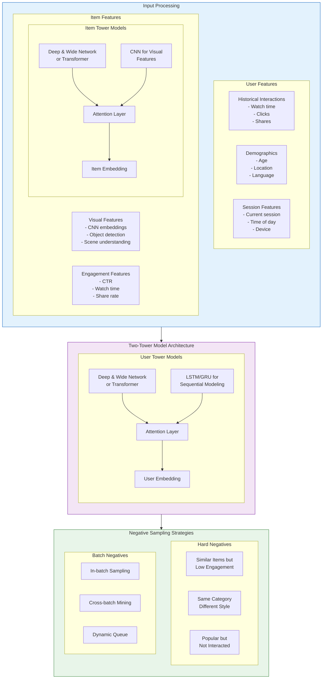
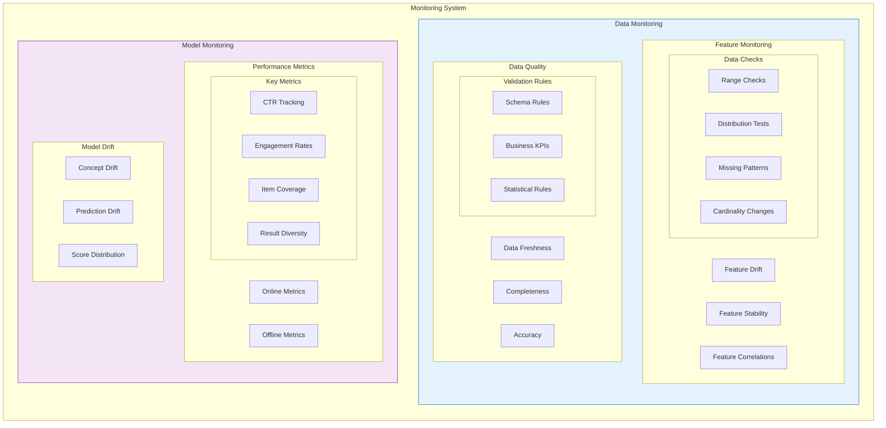

# Instagram Explore Recommendation System Design

## Table of Contents
1. [System Overview](#system-overview)
2. [System Architecture](#system-architecture)
3. [ML Training Pipeline](#ml-training-pipeline)
4. [Two-Tower Architecture](#two-tower-architecture)
5. [Monitoring System](#monitoring-system)
6. [Implementation Details](#implementation-details)
7. [Interview Deep Dive](#interview-deep-dive)

## System Overview

### Problem Statement
Design a large-scale recommendation system for Instagram's Explore tab that delivers personalized content while meeting strict performance requirements:
- Serve billions of items to millions of users
- Maintain latency < 100ms for initial recommendations
- Handle real-time personalization
- Ensure content diversity and freshness
- Scale to millions of QPS

### Requirements Breakdown

#### Functional Requirements
- Personalized content recommendations
- Multi-modal content support (images, videos, Reels)
- Real-time interaction processing
- Cold-start handling
- Content diversity management

#### Non-Functional Requirements
- Latency: < 100ms for initial load
- Availability: 99.99% uptime
- Scalability: Millions of QPS
- Consistency: High recommendation quality
- Freshness: Near real-time updates

## System Architecture

Here's our high-level system architecture:



### Key Components Explanation

1. **Client Layer**
   - Handles progressive loading
   - Implements client-side caching
   - Manages user interactions

2. **Gateway Layer**
   - Load balancing with consistent hashing
   - Rate limiting per user/region
   - Request authentication and validation

3. **Recommendation Service**
   - Multi-stage retrieval and ranking
   - Feature computation and serving
   - Real-time score adjustment

## ML Training Pipeline

Our ML training pipeline design:



## Two-Tower Architecture

Our detailed two-tower model architecture:



## Monitoring System

Our comprehensive monitoring architecture:



## Implementation Details

### Two-Tower Model Implementation

```python
class TwoTowerModel(nn.Module):
    def __init__(self, config):
        super().__init__()
        self.user_tower = UserTower(config)
        self.item_tower = ItemTower(config)
        self.interaction = InteractionLayer(config)
        
    def forward(self, user_features, item_features):
        # User tower processing
        user_embedding = self.user_tower(user_features)
        
        # Item tower processing
        item_embedding = self.item_tower(item_features)
        
        # Compute similarity and additional features
        similarity = self.interaction(user_embedding, item_embedding)
        return similarity
```

### Negative Sampling Strategy

```python
class HardNegativeMiner:
    def __init__(self, embedding_dim, queue_size=1000):
        self.queue = deque(maxlen=queue_size)
        self.similarity_threshold = 0.7

    def find_hard_negatives(self, anchor_embedding, positive_embedding):
        # Compute similarities with queue items
        similarities = cosine_similarity(
            anchor_embedding, 
            self.queue
        )
        
        # Find hard negatives
        hard_negatives = self.queue[
            (similarities > self.similarity_threshold) & 
            (similarities < self.positive_similarity)
        ]
        return hard_negatives
```

### Training Loop with Multiple Objectives

```python
class TrainingPipeline:
    def __init__(self, config):
        self.model = TwoTowerModel(config)
        self.optimizer = self.setup_optimizer()
        self.metrics_tracker = MetricsTracker()
        
    def train_epoch(self, data_loader):
        for batch in data_loader:
            # Multiple training objectives
            engagement_loss = self.compute_engagement_loss(batch)
            diversity_loss = self.compute_diversity_loss(batch)
            watch_time_loss = self.compute_watch_time_loss(batch)
            
            # Weighted combination of losses
            total_loss = self.combine_losses([
                (engagement_loss, self.weights.engagement),
                (diversity_loss, self.weights.diversity),
                (watch_time_loss, self.weights.watch_time)
            ])
            
            # Optimization step
            self.optimizer.zero_grad()
            total_loss.backward()
            self.optimizer.step()
            
            # Track metrics
            self.metrics_tracker.update(batch, total_loss)
```

## Interview Deep Dive

### Key Technical Challenges

1. **Scalability**
   - How to handle billions of items?
   - Strategies for reducing latency
   - Efficient embedding storage and retrieval

2. **Real-time Updates**
   - Stream processing architecture
   - Feature update mechanisms
   - Model retraining strategies

3. **Quality Assurance**
   - A/B testing framework
   - Monitoring and alerting
   - Recovery procedures

### Common Interview Questions

1. **Architecture Decisions**
   Q: Why choose two-tower over other architectures?
   A: Benefits include:
   - Separate user/item processing allows independent scaling
   - Efficient ANN search for retrieval
   - Easy to update towers independently
   - Better caching opportunities

2. **Performance Optimization**
   Q: How to handle cold-start problems?
   A: Multi-strategy approach:
   - Content-based recommendations for new users
   - Metadata-based matching for new items
   - Progressive personalization
   - Exploration strategies

3. **System Design**
   Q: How to ensure high availability?
   A: Multiple layers:
   - Redundant services
   - Circuit breakers
   - Fallback strategies
   - Cache hierarchies

### Performance Optimization Tips

1. **Latency Optimization**
   - Embedding compression
   - Multi-level caching
   - Predictive prefetching
   - Batch prediction

2. **Resource Optimization**
   - Model quantization
   - Efficient feature storage
   - Compute/memory tradeoffs
   - Load shedding strategies

3. **Quality Improvements**
   - Continuous model updates
   - Feature ablation studies
   - A/B testing framework
   - Shadow deployment